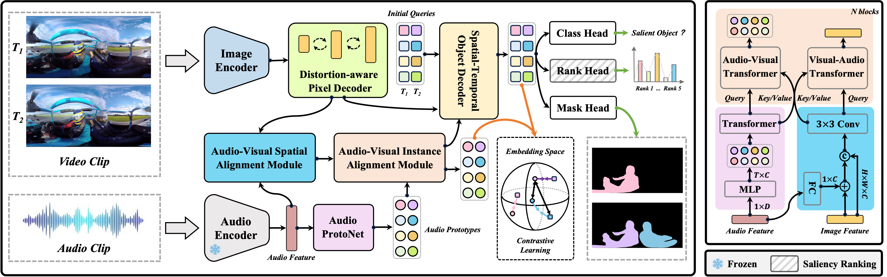

# Instance-Level Panoramic Audio-Visual Saliency Detection and Ranking (ACM MM 24)

Ruohao Guo, Dantong Niu, Liao Qu, Yanyu Qi, Ji Shi, Wenzhen Yue, Bowei Xing, Taiyan Chen, Xianghua Ying*

[`PDF`]() | [`CODE`](https://github.com/ruohaoguo/pavsodr) | [`Cite`](https://github.com/ruohaoguo/pavsodr/tree/main?tab=readme-ov-file#citation)


## News

**25.07.2024:** Our paper is accepted by **ACM MM 2024**!  


## Introduction

<div align="center">
  
</div><br/>

Panoramic audio-visual saliency detection is to segment the most attention-attractive regions in 360°panoramic videos with sound. To meticulously delineate the detected salient regions and effectively model human attention shift, we extend this task to more fine-grained instance scenarios: identifying salient object instances and inferring their saliency ranks. In this paper, we propose the first instance-level framework that can simultaneously be applied to segmentation and ranking of multiple salient objects in panoramic videos. Specifically, it consists of a distortion-aware pixel decoder to overcome panoramic distortions, a sequential audio-visual fusion module to integrate audio-visual information, and a spatio-temporal object decoder to separate individual instances and predict their saliency scores. Moreover, owing to the absence of such annotations, we create the ground-truth saliency ranks for the PAVS10K benchmark. Extensive experiments demonstrate that our model is capable of achieving state-of-the-art performance on the PAVS10K for both saliency detection and ranking tasks.


## Installation

```bash
conda create --name pavsodr python=3.8 -y
conda activate pavsodr
conda install pytorch==1.9.0 torchvision==0.10.0 cudatoolkit=11.1 -c pytorch -c nvidia
pip install -U opencv-python

# under your working directory
git clone https://github.com/ruohaoguo/pavsodr
cd pavsodr

git clone https://github.com/facebookresearch/detectron2
cd detectron2
pip install -e .

cd ..
pip install -r requirements.txt
cd mask2former/modeling/pixel_decoder/ops
sh make.sh

conda install -c pytorch torchaudio
pip install setuptools==59.5.0
```

## Setup

1. Download pretrained weight [model_final_3c8ec9.pkl](https://dl.fbaipublicfiles.com/maskformer/mask2former/coco/instance/maskformer2_R50_bs16_50ep/model_final_3c8ec9.pkl) and put it in ```./pre_models```.
2. Download pretrained weight [soundnet8.pth](https://pan.baidu.com/s/1d0bKaUWoNial1j2ZZDJgWw) (code: 1234)and put it in ```./pre_models```.
3. Download and unzip [datasets](https://pan.baidu.com/s/1qCn9fHLm1zFx4udtIivJ5g) (code: 1234) and put it in ```./datasets```.


## Training

- For PAVSOD: Run the following command
  ```
  python train_net.py \
      --config-file ./configs/pavsodr/R50_PAVSOD.yaml \
      --num-gpus 1
  ```

- For PAVSOR: Run the following command
  ```
  python train_net.py \
      --config-file ./configs/pavsodr/R50_PAVSOR.yaml \
      --num-gpus 1
  ```


## Inference & Evaluation

- Download the trained model [model_pavsod.pth](https://pan.baidu.com/s/1N5yGKcXa0KDtbwatEyiM_g) (code: 1234) and put it in ```./pre_models```. 

- For PAVSOD: Run the following command

  ```
  python test/test_pavsod.py
  ```

- For PAVSOR: Run the following command

  ```
  python test/test_pavsor.py
  ```

## FAQ

If you want to improve the usability or any piece of advice, please feel free to contant directly (ruohguo@foxmail.com).


## Citation

Please consider citing our paper in your publications if the project helps your research. BibTeX reference is as follow.

```

```

## Acknowledgement

This repo is based on [Mask2Former](https://github.com/facebookresearch/Mask2Former) and [detectron2](https://github.com/facebookresearch/detectron2) Thanks for their wonderful works.
